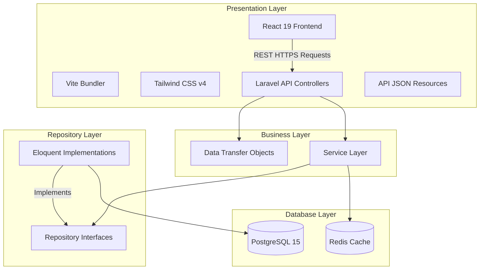

# System Architecture Diagrams

This document explains the physical and logical architecture design of the Nigeria Immigration Service Hospital Management System (NIS HMS).

## Architectural Overview

The application follows the **Clean Architecture** principles to separate concerns into decoupled layers, enhancing maintainability and testability.

## Relational Data Flow

1. **Patient Registration**: Demographics are requested via a `RegisterPatientDTO` form, written to PostgreSQL, and logged in the Audit Trail.
2. **Clinical Triage**: Nurses input vital sign metrics, creating a `Visit` object.
3. **Medical Consultation**: Doctors fetch patient files, write SOAP notes, input ICD-10 diagnoses, and trigger lab tests or drug prescriptions.
4. **Billing & cashier Checkout**: Total balances are calculated, invoices are generated, cashier captures payments, and issues official receipts.
