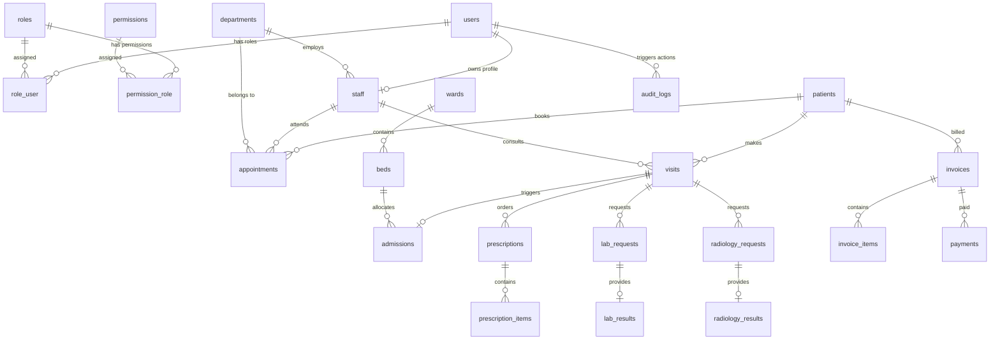

# Entity Relationship Diagram (ERD)

This document shows the database structure and entity relationships of the NIS HMS PostgreSQL schema.

## Third Normal Form (3NF) Compliance

- **No Transitive Dependencies**: Keys determine only attributes directly related to the model (e.g. `beds` belongs to a specific `ward_id`, and `bed_number` is unique to that ward).
- **Relational Integrity**: Foreign key constraints are set with cascading deletions or nullable rules (`onDelete('set null')` or `onDelete('cascade')`).
