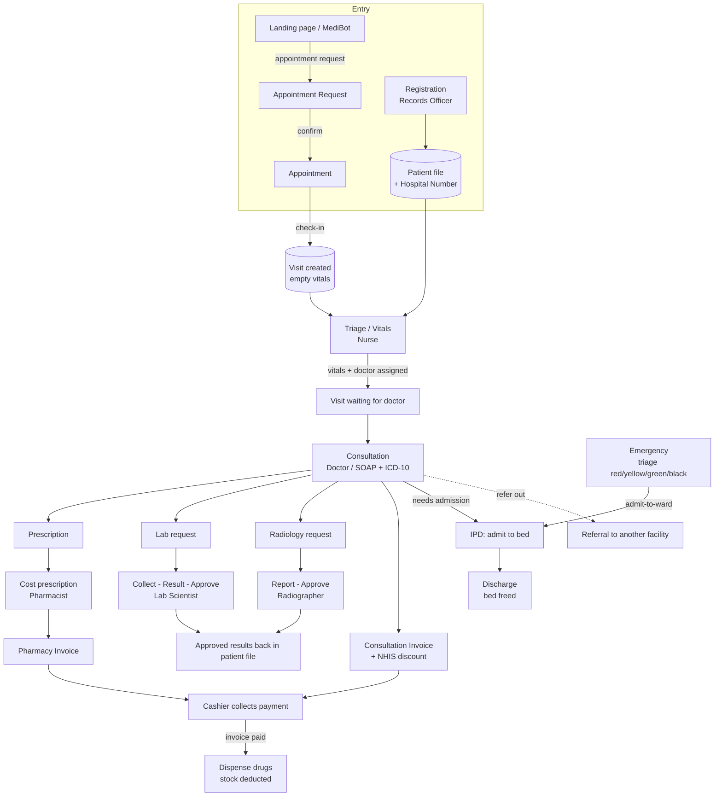

# NIS HMS — Clinical & Operational Workflows

This document describes the complete set of workflows in the Nigeria Immigration
Service Hospital Management System: the end-to-end patient journey, the role that
performs each step, the API endpoint involved, and the records created at each
stage. It reflects the actual behaviour verified by the automated end-to-end
suite (18/18 steps passing).

---

## 1. Core data model

Every workflow revolves around three linked records:

| Record | Represents | Key fields |
| --- | --- | --- |
| **Patient** | The permanent patient file | Hospital Number (`NIS/PAT/xxxxxx`), NIN, sponsor link, allergies, blood group |
| **Visit** | A single clinical encounter | vitals, SOAP notes, ICD-10 diagnosis, `staff_id` (consulting doctor) |
| **Orders** | Work spawned from a Visit | Prescription (+ items), Lab request, Radiology request, Invoice |

A patient enters the pipeline through one of three doors — **outpatient
appointment**, **direct walk-in triage**, or **emergency** — and all three
converge on a **Visit**.

---

## 2. The patient journey (diagram)

---

## 3. Roles and what they can do

Access is enforced by the `role_or_permission` middleware; `super_admin` and
`ict_admin` bypass all checks.

| Role | Primary permissions | Stage(s) |
| --- | --- | --- |
| Records Officer / Receptionist | `register_patients`, `view_patients` | Registration, Appointments |
| Nurse / Ward Manager | `nursing_vitals`, `ward_observations` | Triage / Vitals, IPD |
| Doctor / Consultant | `consult_patients`, `request_tests` | Consultation, orders, referrals |
| Lab Scientist | `fill_lab_results`, `approve_diagnostics` | Laboratory |
| Radiographer | `fill_radiology_results`, `approve_diagnostics` | Radiology |
| Pharmacist / Inventory Officer | `dispense_drugs`, `manage_inventory` | Pharmacy |
| Cashier / Account Officer | `collect_payments`, `create_invoices` | Billing |
| Medical Director / CMO | `view_executive_dashboard`, `view_revenue_reports` | Analytics |
| ICT / Hospital Admin | all | Administration, settings, audit |

---

## 4. Stage-by-stage detail

### Stage 1 — Registration
- **Actor:** Records Officer / Receptionist.
- **Endpoint:** `POST /api/patients` (`PatientController::store`).
- **Validation:** names are letters-only; phone and NIN are digits-only; NIN is
  exactly 11 digits; service/hospital codes are alphanumeric.
- **Patient types:** NIS officer (has immigration service number), dependant
  (linked to a sponsor's service number), or civilian (issued a `NIS/PAT/xxxxxx`
  hospital code).
- **Creates:** a `patients` row.

### Stage 2 — Returning-patient lookup
- **Actor:** any clinical staff.
- **Endpoints:** `GET /api/patients?search=` (by hospital code, name, NIN, phone,
  or sponsor number — case-insensitive); `GET /api/patients/{id}` returns the full
  clinical timeline (visits, diagnostics, prescriptions, admissions).

### Stage 3 — Entry point (a Visit is created)
- **Appointment path:** `POST /api/appointments` → `POST /api/appointments/{id}/check-in`.
  Check-in creates a **Visit with empty vitals** and no doctor assigned yet
  (`visits.staff_id` is nullable), placing the patient in the triage queue.
- **Public / MediBot path:** `POST /api/appointments/request` creates a pending
  request; front desk confirms it (`.../requests/{id}/confirm`) or rejects it.

### Stage 4 — Triage / Vitals
- **Actor:** Nurse.
- **Endpoint:** `POST /api/clinical/vitals` (`ClinicalController::recordVitals`).
- **Behaviour:** records BP, temperature, pulse, etc., and assigns the consulting
  doctor. Fills the patient's same-day pending visit, or creates one.
- **Hand-off signal:** a visit with vitals but no `chief_complaint` = "waiting for
  a doctor" — this feeds the doctor's queue and clinical-staff notifications.

### Stage 5 — Consultation
- **Actor:** Doctor / Consultant.
- **Endpoints:** `GET /api/clinical/active-visit/{patientId}`, then
  `POST /api/clinical/consult/{visitId}`.
- **In one transaction** it writes: SOAP notes + ICD-10 diagnosis onto the visit;
  a Prescription (+ items); Lab requests; Radiology requests; and an **Invoice**
  for the consultation fee (with an automatic **15% NHIS discount** for officers
  and dependants).
- **AI assist:** `POST /api/clinical/ai-chat` — the Clinical AI Advisor (Claude
  when configured, offline knowledge base otherwise) for dosing, interactions,
  protocols, and ICD-10 codes.

### Stage 6 — Diagnostics
- **Laboratory (Lab Scientist):** `GET /api/diagnostics/lab/queue` →
  `collect-sample` → `submit-result` → `approve-result`. Only an approved result
  is surfaced back in the patient file.
- **Radiology (Radiographer):** `submit-result` → `approve-result`.

### Stage 7 — Pharmacy
- **Actor:** Pharmacist.
- **Cost:** `POST /api/pharmacy/prescriptions/{id}/cost` maps each drug to an
  inventory item and price, generating a pharmacy invoice.
- **Dispense:** `.../dispense` — allowed **only after the cashier marks the
  invoice paid**; then stock is deducted. Low stock raises reorder alerts.

### Stage 8 — Billing / Cashier
- **Actor:** Cashier.
- **Endpoints:** `GET /api/billing/invoices/pending`,
  `POST /api/billing/invoices/{id}/pay` (Cash / POS / Bank Transfer / Insurance).
- **Output:** a printable, NIS-branded receipt (print CSS prints only the voucher).

### Stage 9 — IPD / Admission
- **Actor:** Ward staff / Doctor.
- **Endpoints:** `POST /api/ipd/admit` (bed → `occupied`),
  `POST /api/ipd/admissions/{id}/discharge` (bed freed). Wards and beds are managed
  via `POST /api/ipd/wards` and `POST /api/ipd/beds`.

### Emergency track (parallel fast-path)
- `POST /api/emergencies` registers a case with a triage level
  (red/yellow/green/black, sorted red-first). `patient_id` is optional so an
  unidentified walk-in can be recorded.
- `PUT /api/emergencies/{id}` updates treatment; `.../admit-to-ward` routes the
  case into the IPD track.

---

## 5. Cross-cutting workflows

- **Referrals:** `POST /api/referrals` (+ status updates) to send a patient to
  another facility.
- **Notifications:** each stage raises in-app alerts (new appointment request,
  patient waiting, lab result ready, low stock) with persisted read-state.
- **Audit trail:** every mutating request is logged with user, IP and payload
  (passwords masked) by the `audit` middleware.
- **Analytics:** executive KPIs, revenue trends, patient flow, and clinical
  reports aggregate across all stages.
- **MediBot (landing page):** public assistant that answers questions from live
  app data and books appointments by Hospital Number, feeding Stage 3.

---

## 6. End-to-end verification

The automated journey (`register → returning lookup → triage → consult → lab →
pharmacy cost/pay/dispense → billing → IPD admit/discharge → emergency`) passes
18/18 steps, exercising every hand-off: visit state transitions, order creation,
and the invoice → payment → dispense gate.
